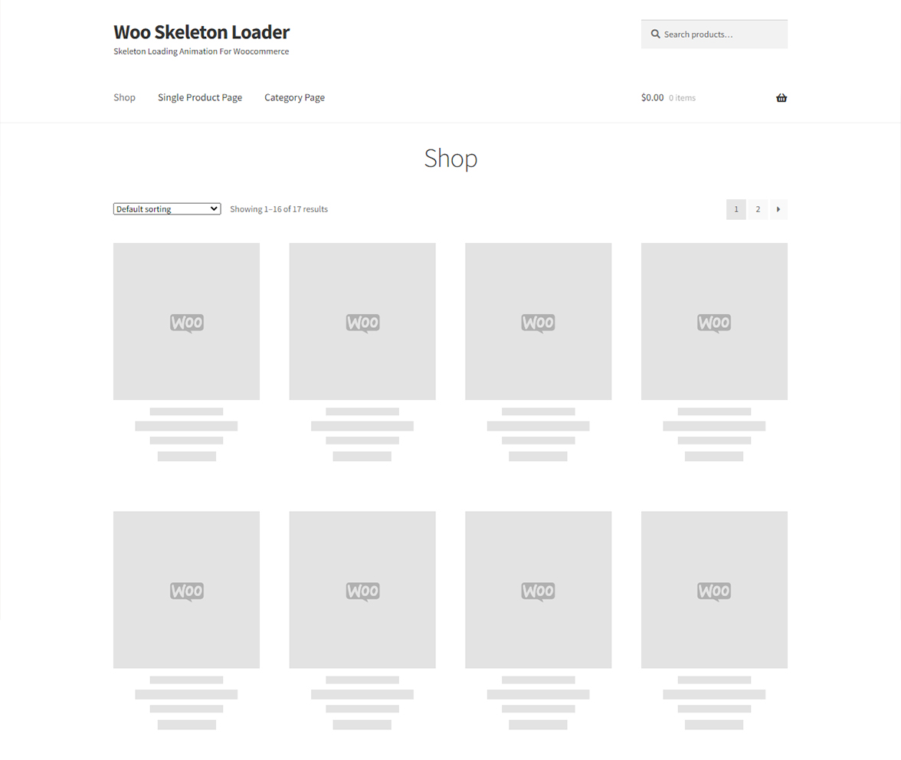
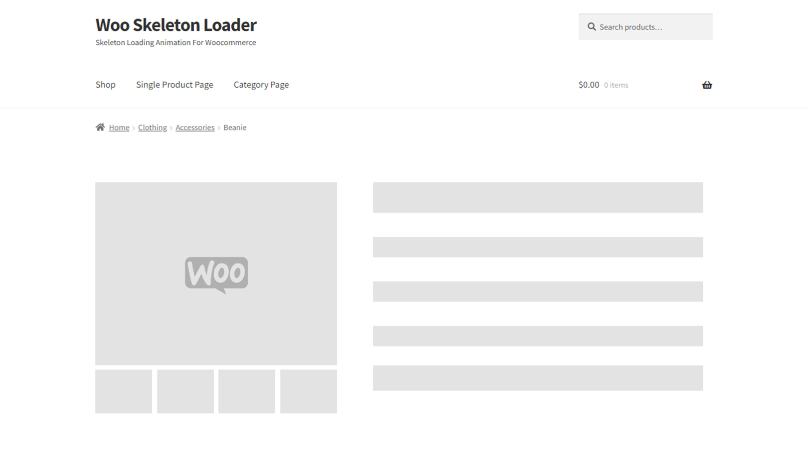

## Products Skeleton Loader Free
## [Download from WordPress.org ](https://wordpress.org/plugins/products-skeleton-loader-free/)

Products Skeleton Loader Adds a Premium Skeleton Loading Animation to your website to attract your visitros / users.
Products Skeleton Loader uses core Woocommerce Hooks to add skeleton to reduces page loading speed.

## Support Developer

### [Buy Me a Coffee](https://www.buymeacoffee.com/danishlaeeq)
### [PayPal](https://www.paypal.com/paypalme/makstudioo/5usd)

## Description 

### Plugin Main features
- Add Premium Look & Feel to your Woocommerce website with Products Skeleton Loader !
- Enable or Disable Skeleton Loading Animation
- Enable / Disable Image Branding
- Add Custom Logo Branding on Loading Animation

### What Can You Do With This Plugin?
Products Skeleton Loader  Adds a Premium Skeleton Loading Animation to your website to attract your visitros / users.
Products Skeleton Loader  uses core Woocommerce Hooks to add skeleton to reduces page loading speed.

Powerful Plugin that helps you grow your business excusivly.
yet simple configuration after Installing the plugin.

[View Demo](https://technodigitz.com/demo/wsl/)
[Buy Premium](https://www.codester.com/items/35168/woocommerce-skeleton-loader?ref=technodigitz)

### Documentation and Support

- For documentation, go to our [Documentation](https://technodigitz.com/docs/wsl/)
- If you have any more questions, visit our support on the [Plugin's Forum](https://www.codester.com/items/comments/35168/woocommerce-skeleton-loader?ref=technodigitz).
- Feel free to [contact us](mailto:info@technodigitz.com) if you want any custom widget for your site.

*Note:* This plugin is a widget of [Woocommerce ](https://wordpress.org/plugins/Woocommerce/) and will only work with Woocommerce  installed.

## Installation & Configuration:

1. Upload the plugin files to the `/wp-content/plugins/plugin-name` directory, or install the plugin through the WordPress plugins screen directly.
2. Activate the plugin through the 'Plugins' screen in WordPress
3. Turn On Products Skeleton Loader  from settings page
4. Turn On Image Branding
5. Add Custom Logo for image branding
6. Done!

## Screenshots 
### Woocomemrce Shop Page

### Single Product Page 

## Frequently Asked Questions
##### Does it work with all Woocommerce Themes?
- Products Skeleton Loader  works with all popular woocommerce themes, but sill if you need help feel free to connect with us

##### Can I add Branding Logo to Skeleton?
- Yes, you can add branding image to skeleton with premium version of the plugin

